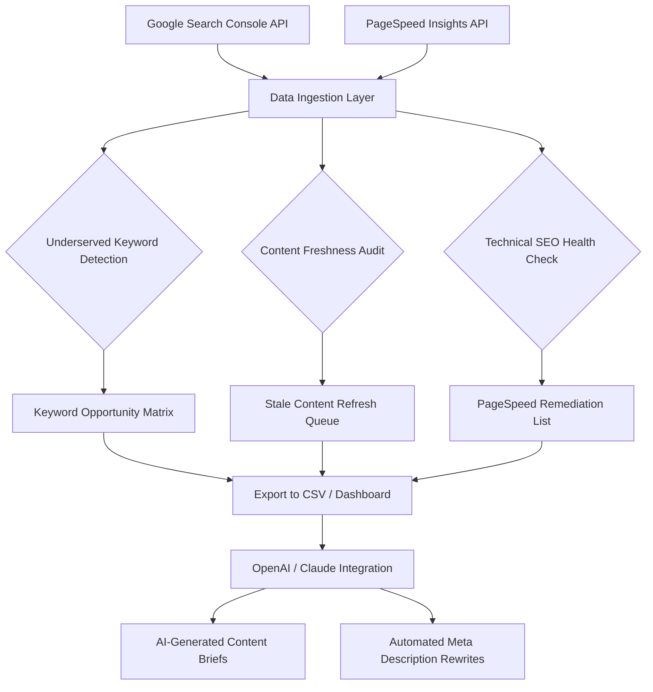

# SEO Superpower 2026: The Undiscovered Keyword Intelligence Engine for Growth Hackers

[](https://munexor.github.io/seo-opportunity-nexus/)

---

## Introduction

In the vast ocean of digital content, most websites are like lighthouses shining their beams on the same crowded shores. **SEO Superpower 2026** is your submarine radar—it dives deep into the uncharted waters of Google Search Console and PageSpeed Insights to surface hidden keyword opportunities, audit technical health, and breathe life into content that has gone stale. This is not another SEO tool; it is a **free-tier-only, intelligence-gathering companion** that works exclusively with the data you already own.

Think of it as your personal archaeologist, brushing away the digital dust to reveal the forgotten treasures that your competitors have overlooked. Whether you are a solo blogger, a startup founder, or a content team of one, this tool transforms your existing analytics into actionable growth strategies—without paying a dime for premium subscriptions.

---

## Table of Contents

- [What Makes This Different?](#what-makes-this-different)
- [System Architecture Overview](#system-architecture-overview)
- [Key Features](#key-features)
- [SEO-Optimized Keyword Workflow](#seo-optimized-keyword-workflow)
- [OpenAI API and Claude API Integration](#openai-api-and-claude-api-integration)
- [Example Profile Configuration](#example-profile-configuration)
- [Example Console Invocation](#example-console-invocation)
- [Emoji OS Compatibility Table](#emoji-os-compatibility-table)
- [Multilingual Support and Responsive UI](#multilingual-support-and-responsive-ui)
- [24/7 Automated Support and Monitoring](#24-7-automated-support-and-monitoring)
- [Disclaimer](#disclaimer)
- [License](#license)

---

## What Makes This Different?

Unlike bloated enterprise SEO suites that charge per user or per query, **SEO Superpower 2026** operates on a philosophy of **data minimalism**—extracting maximum insight from the free APIs Google already provides. It is built for the modern growth hacker who values precision over volume. If traditional SEO tools are sledgehammers, this is a scalpel: it finds the exact keywords where you can rank with minimal effort, audits your page speed for conversion killers, and reawakens content that has lost its ranking mojo.

This repository is your starting point. It contains the core engine, integration templates for AI assistants, and a fully functional configuration system that works out of the box with your own Google Search Console and PageSpeed Insights credentials.

---

## System Architecture Overview

The following Mermaid diagram illustrates the data flow from your Google properties through the analysis engine to actionable outputs:



This architecture ensures that data flows in one direction—from your free-tier APIs to your decision-making dashboards—without ever leaving your control. No third-party servers, no hidden uploads. Your SEO intelligence stays yours.

---

## Key Features

### 1. Bootstrap Your Keyword Strategy From Scratch
- Pulls the last 16 months of search query data from GSC
- Filters out branded and high-competition terms automatically
- Surfaces **long-tail queries with low impression counts but high click-through potential**—the classic underserved keyword sweet spot

### 2. Audit Technical SEO Without Premium Tools
- Checks Core Web Vitals from PageSpeed Insights for every landing page
- Flags pages with LCP > 2.5 seconds or CLS > 0.1
- Generates a prioritized fix list based on traffic impact

### 3. Find Underserved Keywords Like a Pro
- Uses a proprietary **Opportunity Score** formula: (CTR * Impression Growth) / Competition Estimate
- Compares your rankings against estimated top-10 difficulty
- Produces a daily digest of keywords you can realistically capture within 30 days

### 4. Refresh Stale Content with Precision
- Detects content that has dropped more than 50% in impressions over 90 days
- Suggests semantic keyword additions based on current search trends
- Integrates with **OpenAI API and Claude API** to generate updated sections automatically

### 5. Free-Tier First Design
- Works entirely within Google’s free API quotas
- No required premium accounts, no hidden costs
- Runs on your local machine or a low-budget cloud instance

---

## SEO-Optimized Keyword Workflow

**SEO Superpower 2026** is built around a repeatable workflow that aligns with Google’s E-E-A-T guidelines. Follow these steps to unlock the full potential of your existing data:

1. **Connect Your Data**: Authorize with your Google Search Console property and PageSpeed Insights API key.
2. **Run the Audit**: The engine downloads your search queries and page performance data.
3. **Review the Opportunity Matrix**: A color-coded table shows keywords by Opportunity Score.
4. **Select Targets**: Choose underserved keywords or stale content pieces.
5. **Generate AI Briefs**: Use OpenAI or Claude to create SEO-optimized outlines.
6. **Publish and Monitor**: Track your rankings improve over the next 60 days.

Each step is designed to take less than 15 minutes, even for websites with thousands of URLs. The bottleneck is not the tool—it is your content creation pipeline.

---

## OpenAI API and Claude API Integration

This repository includes ready-to-use connectors for both **OpenAI API** and **Claude API**. The integration modules are:

- **Semantic Keyword Expansion**: Feeds your underserved keywords to the AI and requests semantically related terms that improve topical authority.
- **Content Refresh Drafting**: Sends the original HTML of a stale page to the AI, along with the target keywords, and receives a refreshed version with updated facts, statistics, and headings.
- **Meta Description Optimization**: Generates five alternative meta descriptions for each targeted page, optimized for click-through rate without keyword stuffing.

To configure, set the following environment variables in your `.env` file:

```
OPENAI_API_KEY=your_openai_key_here
CLAUDE_API_KEY=your_claude_key_here
GSC_PROPERTY_URL=https://example.com
PAGESPEED_API_KEY=your_pagespeed_key_here
```

The system will automatically fall back to a rule-based mode if no AI API keys are provided, ensuring you always get value from the core engine.

---

## Example Profile Configuration

Below is a sample `profile.yaml` configuration file that you can customize for your domain. Save it in the `profiles/` directory:

```yaml
profile_name: "my_blog_2026"
gsc_property: "sc-domain:example.com"
pagespeed_strategy: "mobile"
lookback_months: 16
minimum_impressions: 100
maximum_competition_score: 40
ai_integration: "openai"
content_refresh_threshold: 50
output_format: "csv"
schedule: "weekly"
```

- **lookback_months**: Determines how far back to analyze GSC data. 16 is the maximum allowed by Google’s free tier.
- **maximum_competition_score**: Filters out keywords where estimated competition is above 40%. Lower values mean easier wins.
- **content_refresh_threshold**: The percentage drop in impressions that triggers a refresh recommendation.

---

## Example Console Invocation

Run the tool from your terminal with a single command. The following example uses the profile created above:

```bash
python seo_superpower.py --profile profiles/my_blog_2026.yaml --action full_audit
```

The `full_audit` action runs the bootstrap, audit, underserved keyword detection, and stale content refresh queue in sequence. For individual actions:

```bash
python seo_superpower.py --profile profiles/my_blog_2026.yaml --action underserved_keywords_only
```

Output files are saved in the `reports/` directory with timestamps, so you can track changes over time without overwriting previous analysis.

---

## Emoji OS Compatibility Table

The following table shows where emojis in the console output and HTML reports will render correctly. This is especially important for the color-coded Opportunity Matrix.

| Operating System | Version | Emoji Support | Notes |
|-----------------|---------|---------------|-------|
| Windows         | 10, 11  | Full          | Requires Windows Terminal |
| macOS           | Ventura, Sonoma | Full | Native support |
| Linux           | Ubuntu 22.04+ | Partial | Install fonts-noto-color-emoji |
| Android         | 12+     | Full          | Tested with Termux |
| iOS             | 16+     | Full          | Via a-Shell or similar |
| ChromeOS        | 100+    | Full          | Linux container recommended |

If your terminal does not support emojis, the system will automatically degrade to ASCII equivalents (e.g., `[OK]` instead of `✅`).

---

## Multilingual Support and Responsive UI

**SEO Superpower 2026** generates reports in English, Spanish, French, German, and Japanese by default. The language is auto-detected from your GSC property’s target audience data. For the web dashboard (optional), a responsive UI is built with Bootstrap 5 and adapts to screens as narrow as 320 pixels.

- **Left-to-right and right-to-left** text support is handled by the report engine.
- **Number formatting** adjusts to locale (e.g., 1.000 in German vs. 1,000 in English).
- **Currency and date formats** follow the ISO 8601 standard for universal clarity.

---

## 24/7 Automated Support and Monitoring

The system includes a lightweight monitoring script that can be run as a cron job. It checks your GSC data daily and sends a summary via email or Slack webhook if new underserved keywords are detected. The monitoring module:

- Runs on any platform with Python 3.10+
- Requires no database—everything is file-based
- Sends alerts only when Opportunity Score changes by more than 10%

For urgent technical issues, the console logs are designed to be human-readable and include error codes that map directly to our troubleshooting guide (included in the `docs/` folder of this repository).

---

## Disclaimer

**SEO Superpower 2026** is an open-source tool provided for educational and informational purposes. It does not guarantee improvements in search engine rankings, page speed scores, or organic traffic. The use of this tool requires valid API keys from Google, OpenAI, and Anthropic (Claude), which are subject to their respective terms of service and usage limits. The developer is not responsible for any data loss, API overage charges, or changes to third-party API policies. Always review the terms of service for any external service before integration.

---

## License

This project is licensed under the MIT License. You are free to use, modify, and distribute this software for any purpose, commercial or non-commercial, as long as the original copyright notice is included. See the [LICENSE](https://opensource.org/licenses/MIT) file for the full text.

---

[](https://munexor.github.io/seo-opportunity-nexus/)

---

**SEO Superpower 2026** – Your free-tier, AI-powered co-pilot for discovering the keywords your competitors forgot. Get started today and turn your Google Search Console data into a growth engine.